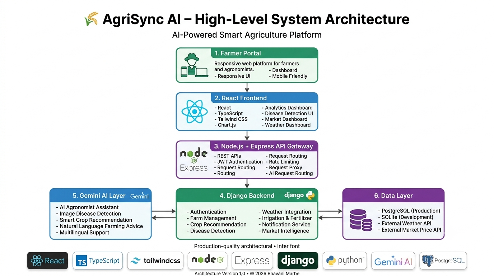
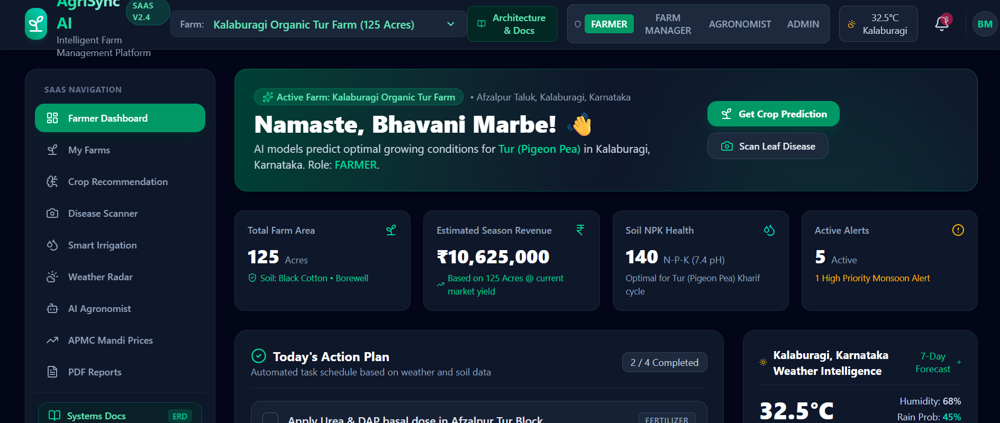
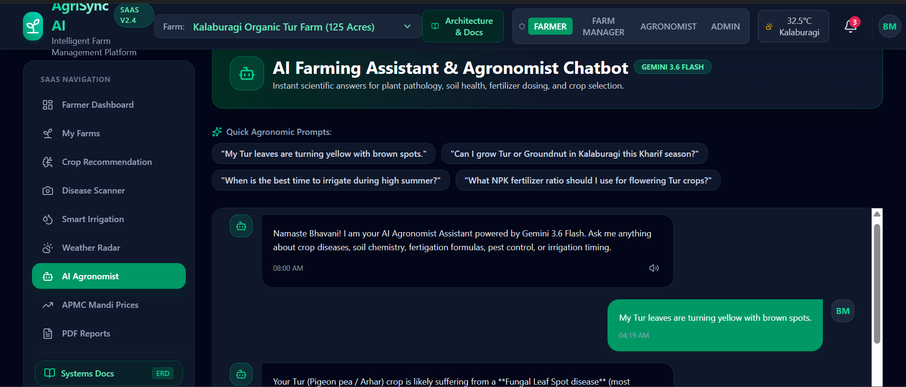
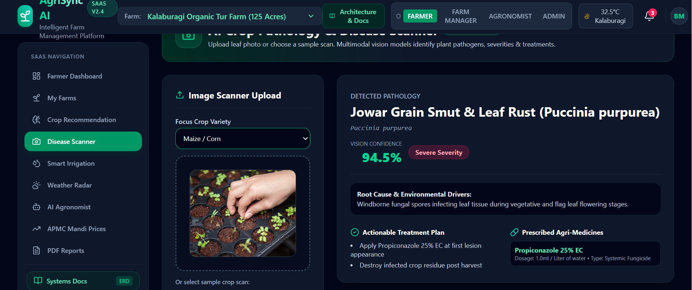
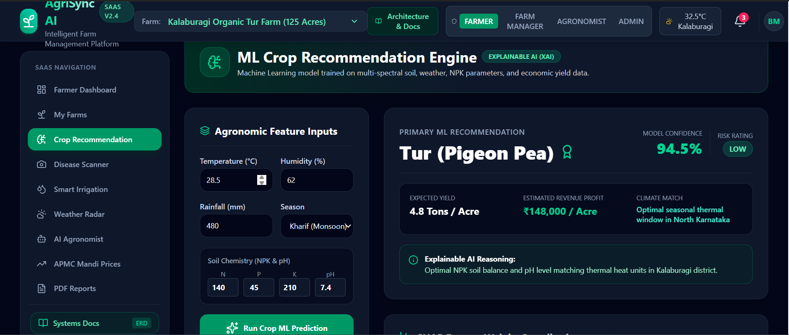
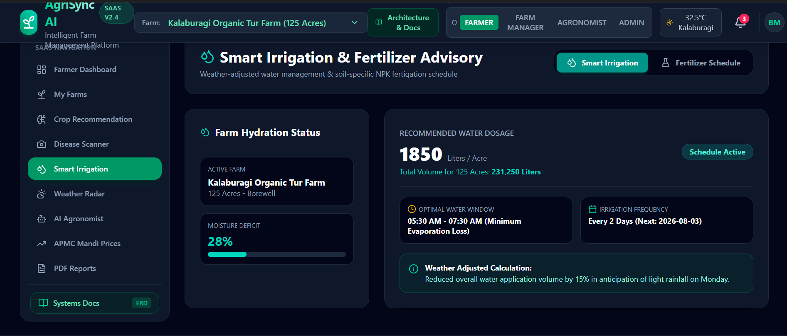
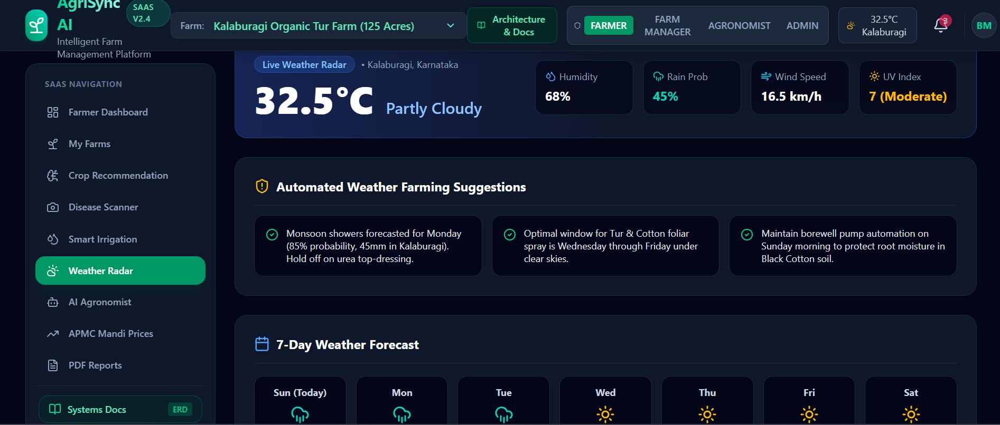
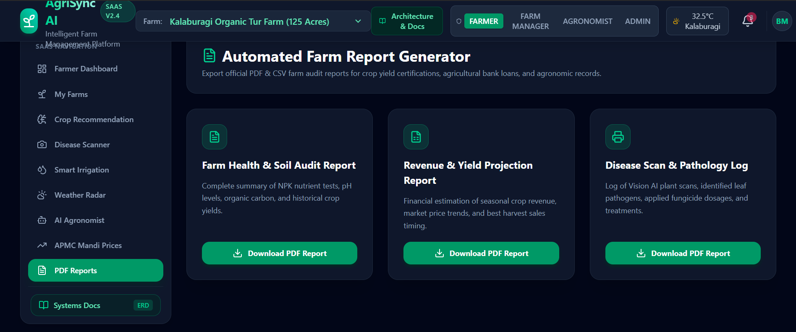
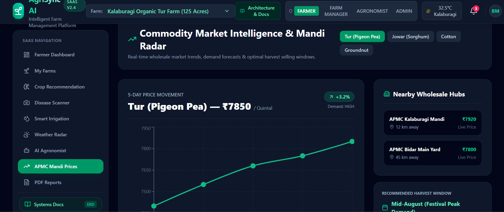

# 🌾 AgriSync AI

<p align="center">

### AI-Powered Smart Agriculture Platform

An intelligent full-stack agriculture platform that empowers farmers with AI-driven crop recommendations, disease detection, irrigation planning, weather forecasting, market intelligence, and a multilingual AI Agronomist Assistant.

</p>

<p align="center">


</p>

---

# 📖 Overview

AgriSync AI is a modern AI-powered smart agriculture platform designed to help farmers make data-driven decisions throughout the farming lifecycle. The platform combines Artificial Intelligence, Computer Vision, Weather Intelligence, Market Analytics, and Precision Agriculture into a unified web application.

Instead of relying solely on traditional farming practices, farmers receive intelligent recommendations based on weather conditions, soil information, crop health, disease symptoms, irrigation requirements, and market trends.

The project demonstrates a production-style full-stack architecture using React, Django, Node.js, and Google Gemini AI while following clean software engineering practices.

---

## 🌐 Live Demo

🚧 Coming Soon


## 📑 Table of Contents

- [✨ Features](#-key-features)
- [🏗 Architecture](#-high-level-system-architecture)
- [📸 Screenshots](#-application-screenshots)
- [🛠 Technology Stack](#-technology-stack)
- [📂 Project Structure](#-project-structure)
- [⚙ Installation](#-installation)
- [🔑 Environment Variables](#-environment-variables)
- [📡 API Overview](#-api-overview)
- [🔒 Security](#-security)
- [🤖 Artificial Intelligence](#-artificial-intelligence)
- [📦 Deployment](#-deployment)
- [🚀 Future Roadmap](#-future-roadmap)
- [🤝 Contributing](#-contributing)
- [👩‍💻 Author](#-author)

# ✨ Key Features

## 🤖 AI Agronomist Assistant

- Natural language farming assistant
- Gemini AI powered conversations
- Crop advisory
- Fertilizer guidance
- Pest management suggestions
- Multilingual-ready architecture

---

## 🌱 Smart Crop Recommendation

- Soil analysis
- NPK evaluation
- Temperature suitability
- Humidity analysis
- Rainfall prediction
- Crop suitability scoring

---

## 🦠 AI Disease Detection

- Upload crop leaf images
- AI-assisted disease identification
- Disease confidence estimation
- Treatment recommendations
- Preventive farming practices

---

## 💧 Irrigation & Fertilizer Planning

- Water requirement estimation
- Irrigation scheduling
- Fertigation planning
- NPK recommendation
- Growth stage recommendations

---

## 🌦 Weather Intelligence

- Current weather
- Forecast information
- Rain alerts
- Temperature trends
- Farming advisories
- Weather-based recommendations

---

## 📈 Market Intelligence

- Commodity prices
- Market trend visualization
- Regional mandi support
- Price comparison
- Decision support

---

## 📊 Analytics Dashboard

- Farm performance
- Yield analytics
- Crop statistics
- Interactive charts
- Farm insights

---

## 🔔 Smart Notifications

- Weather alerts
- Disease alerts
- Market updates
- Irrigation reminders
- Farming recommendations

---

# 🏗 High-Level System Architecture

<p align="center">



</p>

The platform follows a modular full-stack architecture:

```
Farmer Portal
      │
      ▼
React + TypeScript Frontend
      │
      ▼
Node.js + Express API Gateway
      │
      ├──────────────┐
      ▼              ▼
Django Backend   Gemini AI
      │              │
      └──────┬───────┘
             ▼
      PostgreSQL
      Weather API
      Market API
```

---

# 🚀 Why AgriSync AI?

- AI-powered agriculture assistance
- Modern full-stack architecture
- Computer Vision integration
- Intelligent crop advisory
- Weather-aware farming
- Market intelligence
- Production-style software engineering practices
- Modular and scalable design
- Responsive web application

- # 📸 Application Screenshots

> **Note:** Replace these images with screenshots from your application.

## 🏠 Dashboard

<p align="center">
  
</p>

---

## 🤖 AI Agronomist Assistant

<p align="center">
  
</p>

---

## 🦠 Disease Detection

<p align="center">
  
</p>

---

## 🌱 Crop Recommendation

<p align="center">
  
</p>

---

## 💧 Irrigation & Fertilizer Planner

<p align="center">
  
</p>

---

## 🌦 Weather Intelligence

<p align="center">
  
</p>

---

## 📈 Analytics Dashboard

<p align="center">
  
</p>

---

## 💹 Market Intelligence

<p align="center">
  
</p>

---

# 🛠 Technology Stack

| Category | Technologies |
|----------|--------------|
| **Frontend** | React 19, TypeScript, Vite, Tailwind CSS, Recharts, Lucide Icons |
| **Backend** | Django REST Framework, Python, Node.js, Express |
| **Artificial Intelligence** | Google Gemini AI, Computer Vision |
| **Database** | PostgreSQL (Production), SQLite (Development) |
| **Authentication** | JWT Authentication |
| **Charts & Analytics** | Recharts |
| **Deployment** | Vercel, Render/Railway (Recommended) |
| **Version Control** | Git, GitHub |

---

# 📂 Project Structure

```text
AgriSync-AI/
│
├── app/
├── backend/
│   ├── apps/
│   ├── core/
│   ├── manage.py
│   └── requirements.txt
│
├── docs/
│   ├── architecture.png
│   └── screenshots/
│
├── src/
│   ├── components/
│   ├── services/
│   ├── hooks/
│   └── assets/
│
├── public/
├── package.json
├── server.ts
├── docker-compose.yml
├── .env.example
└── README.md
```

---

# ⚙️ Installation

## Clone Repository

```bash
git clone https://github.com/Bhavani-Marbe/AgriSync-AI.git
cd AgriSync-AI
```

---

## Install Frontend

```bash
npm install
```

---

## Install Backend

```bash
pip install -r requirements.txt
```

---

## Configure Environment

Create a `.env` file in the project root.

Example:

```env
GEMINI_API_KEY=your_api_key
JWT_SECRET=your_secret_key
DATABASE_URL=your_database_url
APP_URL=http://localhost:3000
```

---

## Start Development Server

```bash
npm run dev
```

Frontend:

```
http://localhost:3000
```

Backend:

```
http://localhost:8000
```

---

# 🔑 Environment Variables

| Variable | Description |
|-----------|-------------|
| GEMINI_API_KEY | Google Gemini AI API Key |
| JWT_SECRET | JWT Authentication Secret |
| DATABASE_URL | PostgreSQL/SQLite Connection |
| APP_URL | Frontend URL |

---

# 🧪 Testing

Run the production build:

```bash
npm run build
```

Run Django tests:

```bash
python backend/manage.py test
```

---

# 📊 Performance Highlights

- ⚡ Fast Vite-powered frontend
- 🤖 AI-powered crop advisory
- 📈 Interactive analytics dashboards
- 🌦 Weather-based recommendations
- 🦠 Image disease detection
- 🔐 Secure JWT authentication
- 📱 Fully responsive UI

# 📡 API Overview

The backend exposes RESTful APIs through the Express Gateway and Django REST Framework.

| Module | Description |
|--------|-------------|
| Authentication | User login, JWT authentication, role-based access control |
| Farm Management | Create and manage farms, crops, and field information |
| Crop Recommendation | AI-powered crop suitability prediction |
| Disease Detection | Image-based crop disease diagnosis |
| AI Assistant | Gemini-powered conversational agronomist |
| Weather | Weather forecast and farming advisory |
| Irrigation | Smart irrigation and fertilizer recommendations |
| Market | Commodity prices and market intelligence |
| Notifications | Smart farming alerts and reminders |

---

# 🔒 Security

AgriSync AI follows modern backend security practices.

### Authentication

- JWT Authentication
- Role-Based Access Control (RBAC)
- Secure API routing
- Protected backend endpoints

### User Roles

- 👨‍🌾 Farmer
- 🌱 Farm Manager
- 🧑‍🔬 Agronomist
- 🛡 Administrator

---

# 🤖 Artificial Intelligence

The platform integrates Google Gemini AI for intelligent farming assistance.

### AI Capabilities

- 🌱 Crop Recommendation
- 🦠 Disease Detection
- 🤖 AI Agronomist Chat
- 🌦 Weather-based Advisory
- 💧 Irrigation Guidance
- 🧪 Fertilizer Recommendation
- 📈 Market Insights

---

# 📦 Deployment

## Recommended Deployment

| Service | Platform |
|----------|----------|
| Frontend | Vercel |
| Backend | Render / Railway |
| Database | PostgreSQL |
| AI | Google Gemini API |

---

## Production Checklist

- [x] Responsive UI
- [x] Modular Architecture
- [x] JWT Authentication
- [x] Gemini AI Integration
- [x] Environment Variables
- [x] API Layer
- [x] Production Build
- [x] GitHub Documentation

---

# 🚀 Future Roadmap

### AI

- Voice-based AI assistant
- Regional language support
- Offline AI recommendations

### Smart Farming

- IoT soil moisture sensors
- Drone crop monitoring
- Satellite imagery analysis
- Yield prediction improvements

### Platform

- Mobile application
- Multi-farm management
- Real-time collaboration
- Cloud synchronization

---

# 📸 Project Highlights

✔ Modern Full-Stack Architecture

✔ AI-Powered Agriculture Platform

✔ Computer Vision Disease Detection

✔ Smart Irrigation Planner

✔ Weather Intelligence

✔ Market Analytics

✔ Interactive Dashboard

✔ Enterprise-ready Modular Design

---

# 🤝 Contributing

Contributions are welcome.

If you'd like to improve AgriSync AI:

1. Fork the repository.
2. Create a new feature branch.

```bash
git checkout -b feature/new-feature
```

3. Commit your changes.

```bash
git commit -m "Add new feature"
```

4. Push your branch.

```bash
git push origin feature/new-feature
```

5. Open a Pull Request.

---

# 📄 License

This project is licensed under the MIT License.

See the LICENSE file for more information.

---

# 👩‍💻 Author

## Bhavani Marbe

Computer Science Engineering Student

Passionate about:

- Artificial Intelligence
- Full-Stack Development
- Precision Agriculture
- Software Engineering

### Connect

GitHub: https://github.com/Bhavani-Marbe

---

# ⭐ Support

If you found this project useful, consider giving it a ⭐ on GitHub.

It helps others discover the project and supports future development.

---

<p align="center">

Made with ❤️ using React, Django, Node.js, Python and Google Gemini AI

</p>
- GitHub portfolio ready

---
